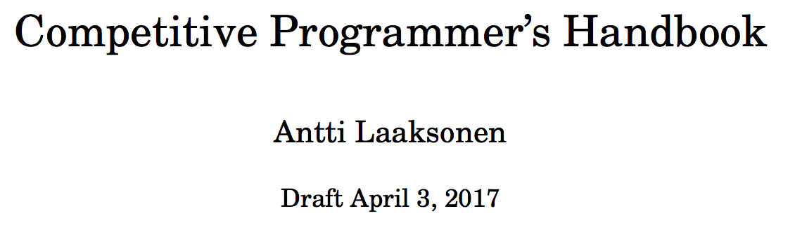

# competitive_programmer_handbook
Algorithms that I studied on the book: Competitive Programmer's Handbook by Antti Laaksonen. I have a physical copy of this book, and its amazing, I learned a lot reading every line os this book, and writing code from it. Thanks Antti!

